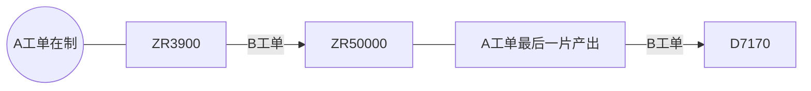
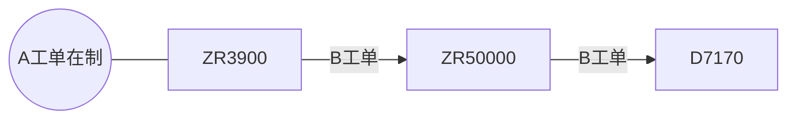

## 标准功能

| 序号  | 设备采集及控制功能                      |     | 设备信息 | 说明                                      |
| --- | ------------------------------ | --- | ---- | --------------------------------------- |
| 1   | [设备模式监控功能](#functionOne)       | 下发  | 所有设备 | 设备支持离线、在线模式；离线指 IoT 系统不能控制设备，但是都可以抓取数据。 |
| 2   | [设备联网状态监控功能](#functionTwo)     | 数采  | 所有设备 | 设备及 IoT 都需要各自监控联网状态。                    |
| 3   | [IoT 联网状态监控功能](#functionThree) | 数采  | 所有设备 | 设备及 IoT 都需要各自监控联网状态。                    |
| 4   | [设备状态监控功能](#functionFour)      | 数采  | 所有设备 | 设备状态一般包括运行、待机、故障、停止、保养等状态。              |
| 5   | [设备警报报告功能](#functionFive)      | 数采  | 所有设备 | 设备报警的信息采集。                              |
| 6   | [远程信息下发功能](#functionSix)       | 下发  | 所有设备 | IoT 系统下发信息给设备。                          |
| 7   | [远程时间同步功能](#functionSeven)     | 下发  | 所有设备 | IoT 同步设备的日期和时间。                         |
| 8   | [设备生产数据上报](#functionEight)     | 数采  | 所有设备 | 设备生产过程中的实时生产数据。                         |

### [设备模式监控功能](#标准功能)

*在人员按了 Local 按钮的一瞬间，且当前设备模式为 Remote 模式，就将模式切换为 Local 模式；反之，在人员按了 Remote 按钮的一瞬间，且当前设备模式为 Local 模式，就将模式切换为 Remote 模式。*

> Local：**`L264（开关功能）` = `ZR112为 0（当前设备模式显示）` = `L270（指示灯功能）`**
>
> Remote：**`L262（开关功能）` = `ZR112为 1（当前设备模式显示）` = `L271（指示灯功能）`**

`L262`、`L264`为人机上交互的按钮。

- `L262`为 Remote 按钮，用于切换设备模式为**在线模式**；
- `L264`为 Local 按钮，用于切换设备模式为**离线模式**。
  `ZR112`为人机上显示当前设备模式的点位。按照`设备交互文档`中所说，**`1表示在线，0表示离线`**。所以我们需要将人机上这一点位作出以下修改：
1. STEP 1: 点击右上角编辑页首，双击 CIM Mode 下`Remote`显示其属性。
   
- 点击`显示`,`状态0`时的`登录讯息`修改为`Local`；`状态1`时的`登录讯息`修改为`Remote`。
  
  
2. STEP 2: 点击`颜色`，修改`状态1`的`底板颜色`为`29`；修改`状态0`的`底板颜色`为`6`。
   
   
3. STEP 3: 最后点击`确定`完成此次修改。

---

`L262`、`L264`为**开关功能**的点位，随着人员的点按而 ON/OFF，而切换到 Remote 模式时，**指示灯功能**的点位会常 ON，表示当前模式为 Remote 模式。Local 模式也一样。所以需要将 Local 模式和 Remote 模式的**指示灯功能**分别修改为`L270`和`L271`。

### [设备联网状态监控功能](#标准功能)

*IoT 监控设备上`ZR3005`的值是否持续一秒加 1，若未能监测到，则表示设备断网。`ZR3005`的值达到 65535 后会被置 0，然后重新开始一秒加 1。*

### [IOT 联网状态监控功能](#标准功能)

*IOT 联网时，每秒加 1 写入`ZR3010`,Remote 模式下实时将`ZR3010`的值与之前写入的值进行比较，若 9 秒内仍未发生变化，设备判断 IOT 断网，发出警报并蜂鸣。警报点位一般为`L2021`。*

> 之前写入的值为`D0`的值。

IOT 断网警报不会影响机台继续生产，且可以通过按下机台上的重置按钮来消除警报及蜂鸣。`L4097`就是 I/O 点位置换后的重置点位，对应了机台上的重置按钮。

> **I/O 点位置换**
>
> 
> 将`X200`到`X23F`置换为`L4096`到`L4159`
>
> 
>
> 

> **`K4X200`**
> 这是三菱的组合位元件，三菱系列的 PLC 可以这种位元件组的形势接收或发送二进制数据，一个位元件组（`K1X200`）由 4 个连续的 bit 组成。
> 
> `KnMm`格式的数据意思是从`Mm`开始的`n*4`位所组成的数据，n 可以为 1，2，3，4，形式可以是`KnMm`，`KnXm`，`KnYm`。
> 
> ---
> 
> 举个 🌰
> `K2X0`——从`X0`开始的`2*4`位所组成的数据，也就是`X7`、`X6`、`X5`、`X4`、`X3`、`X2`、`X1`、`X0`这 8 位所组成的数据。
> `K1M10`——从`M10`开始的`1*4`位所组成的数据，也就是`M3`、`M2`、`M1`、`M0`这 4 位所组成的数据。

### [设备状态监控功能](#标准功能)

*设备状态共五种，详情见下表：*

| 运行          | 故障          | 闲置          | 停机          | 保养          |
|:-----------:|:-----------:|:-----------:|:-----------:|:-----------:|
| 原点复归并启动     | 出现异常并停机     | 启动后流片间隔     | 无原点复归，无启动   | 原点复归，无启动    |
| `ZR120 = 0` | `ZR120 = 1` | `ZR120 = 2` | `ZR120 = 3` | `ZR120 = 4` |

> `ZR120`为人机上点位
> 

### [设备警报报告功能](#标准功能)

*与上面提到的**I/O 点位置换**同理，将`L2000`到`L2639`的警报实时传送到`M7300`到`M7939`，共计 40 word（即 640 bit）。*

### [远程信息下发功能](#标准功能)

*通过索引触发远程下发信息在人机上的显示、蜂鸣器及三色灯，内容可支持显示 124 个 ASCII 字符。同时，若 IOT 下发的消息类型是**间隔消息**，需要提供**间隔秒数**；若 IOT 下发的消息类型是**持续消息**，则蜂鸣器会长鸣。两个消息类型都可由人员手动解除。*

- `ZR60005`为人机上点位，用于显示信息的内容
- `ZR2029.1`为人机上点位【Confirm】，用于手动确认信息已收到，可解除信息的显示、蜂鸣器及三色灯。

---

`ZR3837`为 IOT 下发的索引，若当前索引与上一次索引（即`ZR3838`）不同，则会触发信息框的显示。

CIM Message 信息框的画面编号为 5，所以视窗画面`D2517`的值为 5。

视窗显示位置的`D2518`、`D2519`为 CIM Message 信息框显示的 X、Y 坐标。

 

在人员手动按下【Confirm】按钮后（即`ZR2029.1`这一软元件位 ON 了之后)，将上面的视窗控制、视窗画面和视窗显示位置均清零，同时清空信息内容与消息类型，便可达到人员手动可解除信息显示、蜂鸣器及三色灯的效果。

> 由于三色灯及蜂鸣器是根据消息类型触发，所以一旦消息类型被清空，三色灯及蜂鸣器也会随之解除。
> 增加 IOT 对消息的间隔秒数（即`ZR3836`）设置
> 
> 之后将`B1501 T95`、`B1502`并联到蜂鸣器及三色灯的输入条件中即可。

### [远程时间同步功能](#标准功能)

*通过比对当前索引值与上一次索引值，比对结果为不一致时触发时间同步功能。从`ZR4290`到`ZR4296`共 7 个点位，**依次为：年、月、日、时、分、秒、星期**，增加范围控制（如**分**、**秒**只可为 0 至 59，**时**只可为 0 到 23 等）。*

> **需要同步为`ZR4290`到`ZR4296`指定的时间日期，并显示到`SD210`到`SD216`**

> 对于**星期（即`ZR4296`）**，0：星期日，1 到 6：星期一到星期六

`DATEWR`是时间的写入，并**不会**随着实际时间而一秒一秒的改变显示的时间。  

它写入到`DATERD`后的点位（如`SD210`），而`DATERD`后的点位才会与实际时间一样改变。  

### [设备生产数据上报](#标准功能)

*此功能只需要提供点位供 IOT 采集数据，无需 PLC 程序的编写，故不作解释。*

## 放板机

| 序号  | 设备采集及控制功能                                | 设备信息 | 说明                                                      |
| --- | ---------------------------------------- | ---- | ------------------------------------------------------- |
| 9   | [设备启停控制](#functionNine)                  | 所有设备 | 上板机能接收 IoT 下发的停机/开机指令。                                  |
| 10  | [是否存在载具信号](#functionTen)                 | 所有设备 | 上板机中没有载具的时候，需产生空料信号。                                    |
| 11  | [采集 Cassette ID](#functionEleven)        | 所有设备 | 上板机扫描 cassette ID 时，需将 cassette ID 信息上传，如果扫描不成功需要报警。    |
| 12  | [切换生产信息](#functionTwelveAndThirteen)     | 所有设备 | 上板机在收到 IoT 下发的新 cassette 信息时，设备然后 cassette 投入数量清零，并重新计数 |
| 13  | [生产信息切换完成指令](#functionTwelveAndThirteen) | 所有设备 | 当设备切换生产信息完成时上报给 IOT。                                    |
| 14  | [设备投入 Panel 信号](#functionFourteenPcbIn)  | 所有设备 | 设备投入 Panel 信号                                           |
| 15  | [设备产出 Panel 信号](#functionFifteenPcbIn)   | 所有设备 | 设备产出 Panel 信号                                           |
| 16  | [删除待生产虚拟 Panel 信息指令](#functionSixteen)   | 所有设备 | 删除待生产虚拟 Panel 信息指令                                      |
| 17  | [控制取放板](#functionSeventeen)              | 所有设备 | 上板机能接收 IoT 下发的投板信号。（0：不投板，1：投板）                         |
| 18  | [镭雕请求条码](#functionEighteen)              | 所有设备 | 上板机检测到板子到达镭雕位置时，触发向上“请求条码”。（镭雕打码）                       |

### 设备启停控制

[返回放板机](#放板机)/[返回中间段](#中间段)/[返回收板机](#收板机)

*由 IOT 触发设备的启动与停止。需要注意的是：**厂内威家骅设备在启动前都需要进行原点复归**。*

> 原点复归
> 
> 

- IOT 请求启动设备 ➡️ 人员确认设备原点复归完成 ➡️`B451`被设置为 ON➡️`L256`被设置为 ON➡️ 启动后将`L256`设置为 OFF

- IOT 请求停止设备 ➡️`B450`被设置为 ON➡️`L257`被设置为 ON➡️ 停止后将`L257`设置为 OFF
  
  > `L256`为人机上启动按钮；
  > `L257`为人机上停止按钮。

设备完成启动或停止的动作，经过 2s 延迟之后将回复代码（`ZR30020.0`）设置为 1；
若没有完成启动或停止的动作，则经过 2s 延迟之后将回复代码（`ZR30020.0`）设置为 0。
回复代码（`ZR30020.0`）之后，将交握回复设置为 ON，同时将`B450`和`B451`恢复到 OFF 状态。

### 是否存在载具信号

[返回放板机](#放板机)/[返回中间段](#中间段)/[返回收板机](#收板机)

*机台工作位上一般都会有检测是否存在载具的感应器。*
*感应器 ON 则表示存在载具；感应器 OFF 则表示不存在载具。*

有些程序中会将感应器输出到`ZR2025.5`这个点位（可能是为了规范性吧），如果有`ZR2025.5`这一点位，直接用这个点位就好。如果没有，也可以选择直接用感应器。

---

- 感应器判断无载具时，会将`ZR39900`置`0`，同时将`D7230`(不存在载具)置`1`，0.2s 延迟之后将索引值`ZR41405`改变。

- 感应器判断有载具时，会将`ZR39900`置`1`，同时将`D7231`(存在载具)置`1`，0.2s 延迟之后将索引值`R41405`改变。
  
  > IOT 采集是**否存在载具的信号**的时机点是**索引值发生了变更**。

### 采集 Cassette ID

[返回放板机](#放板机)/[返回中间段](#中间段)/[返回收板机](#收板机)

*情况一：如果读取 Cassette ID 3 次后仍然失败，则发出报警`L2450`。*
*情况二：如果读取 Cassette ID 成功，则设定好的`D8105`到`D8109`范围内会存储 Cassette ID。读取完成后`M1500`会 ON,读取到的 ID 也会传送到`ZR3930`开始的 10 个 word。0.1s 延迟后将索引值变更，IOT 监控到索引值变更，就会采集 Cassette ID。*

PLC 与 Reader 的通讯设置完毕后，还需要在 PLC 程序中添加**触发**和**采集 Reader 的读取结果**的程序，这一部分在`IOT_MES各功能.gxw`文件中的`M98`部分有完整的程序，可直接复制添加到程序中。

> - **Local 状态下，机台升到工作位，按下 Reload 按钮**可触发并采集 Reader 的读取结果，读取完成后`M4360 ON`；
> - **Remote 模式下，机台升到工作位**即可触发并读取 Reader 的读取结果，读取完成后`M4360 ON`。
> - **工作位上无载具**或**按下 Reload 按钮的一瞬间**，会将`M4360 OFF`。

以下几种情况会将将读取完成信号`M1500`及 IOT 采集读取结果的`ZR3930`开始的 10 个 word 的点位清空复位：

1. 对于放板机来说，完板时
2. 对于收板机来说，满板时
3. 无载具在工作位时
4. 按下人机上 Reload 按钮时

### 切换生产信息 & 生产信息切换完成指令

[返回放板机](#放板机)/[返回中间段](#中间段)/[返回收板机](#收板机)

*IOT 先请求下发生产信息，下发的生产信息会给到**预生成**中，在满足切换条件后将**预生成**的生产信息切换为**在制**。切换完成后回复 IOT 切换完成，且将切换完成的索引值变更，IOT 在该索引值变更后会采集**在制**的生产信息。*

***生产片数到达工单数量，载具下降后*** 或 ***刚切换到Local模式时*** 将在制工单信息（`D7170`）和放板片数（`D2004`）清零；而预生成的工单信息（`ZR50000`）只有在 ***刚切换到Local模式时*** 才清零。

> **生产信息** 
>
>   
>
> >   生产信息中包括**工单**和**配方**，后者只有在 IOT 下发了切换配方的指令时才会进行配方的切换，否则就只是进行工单的切换而已。
>
> **预生成** 
>
> 相当于第三方，下发的生产信息先给到预生成，在满足切换条件后再切换为在制（在制的生产信息会显示到人机界面中），所以预生成有没有切换为在制，可以从人机界面上看到，下图中红色框内即**在制的生产信息**。
> 

生产信息对应的**IOT 下发点位**、**预生成点位**、**在制点位**如下，也可在`设备交互文档-汇总-PLC.xlt`中找到。

##### 满足条件的“条件”是指什么？

> 这是 IOT 给出的描述：
> 当设备投入板带有最后板信号时触发：
> 
> 1. 设备先判断是否需要切换配方，需要切换配方，需要等到上一个载具全部投产完成，才切换载具信息。
> 2. 是否往下出板信号，当为 0 时设备最后板投产完成，需要设备自身控制禁止出板。为 1 时设备则不需要管控。

关键词是**是否切换配方**、**最后板投产完成**和**控制禁止出板**。

实际上线时发现，由于投收板机的载具水位无法确保一致，而这推翻了之前**一个载具就是一个工单**的系统架构。为了提高生产效率，真正实现多工单生产带帐 ，做出了以下修改：

**结批流程修改前**

-   载具下降➡️上传 IOT 退port信号，设备清除工单信息➡️在制工单结批

**结批流程修改后**

-   人员手动在MES系统上强制将工单结批➡️MES 告知 IOT 该工单已结批➡️IOT 告知设备该工单已结批，设备清除工单信息【***优先级最高***】

-   设备自行判断在制工单数量收板完成后➡️上传 IOT 退port信号，设备清除工单信息➡️在制工单结批

##### 总结

- 设备内无板
  - IOT 下发**A 工单**的生产信息到`ZR3900`开始的点位，由设备将**A 工单**的生产信息数据传送到`ZR50000`开始的点位，再切换到在制`D7170`开始的点位。

- 设备内有板
  - 切换配方
    - IOT 下发**B 工单**的生产信息到`ZR3900`开始的点位，由设备将**B 工单**的生产信息数据传送到`ZR50000`开始的点位，等待**A 工单**的板子全部产出后再切换到在制`D7170`开始的点位，包括需要切换的配方。

- 设备内有板
  - 不切换配方
    - IOT 下发**B 工单**的生产信息到`ZR3900`开始的点位，由设备将**B 工单**的生产信息数据传送到`ZR50000`开始的点位，由于不切换配方，所以不必等待**A 工单**的板子全部产出，只需收**A 工单**的载具下降后再上升时，将**B 工单**切换到在制`D7170`开始的点位。

### [设备投入 Panel 信号](#放板机)

*在 IOT 下发[允许投板](#functionSeventeen)的指令后，手臂才会下降吸板，从步进位中找到合适的点位作为投入 Panel 信号的时机点，0.1s 延迟后将投入的索引值变更。IOT 监控到该索引值变更后便会采集投入 Panel 的帐。*

> **帐** 
>
> 
>
> **料** 
>
> 实体的板子 
>
> **有料无帐**
>
> 简单来说，就是在投入时没有该板子对应的帐。

从上图中可以看出来，放板机的**虚拟 Panel ID**以及**是否最后一块板**是由设备自己生成的。

- 虚拟载具码`ZR450`，即 Cassette Code，是 IOT 在下发生产信息时就会提供的数据；
- 虚拟 Panel ID`ZR451`，是在合适的时机点由设备自动生成，每投入一块板子，`ZR451`便会自动加 1，生产片数到达工单数量，载具下降后将其清零；

- 是否最后一块板，同样在生产片数到达工单数量后，将此信号赋值为 1。

  ### [设备产出 Panel 信号](#放板机)

*与产出类似，从步进位中寻找合适的点位作为产出 Panel 信号的时机点，或者使用出料感应器的下降沿作为此时机点，0.1s 延迟后将产出的索引值变更。IOT 监控到该索引值变更后便会采集产出 Panel 的帐。*

> 对于放板机来说，从投入到产出是一个完整的带帐过程，期间还包括可能存在的**拔片**，即[删除设备待生产虚拟 Panel 信息指令](#functionSixteen)。
> 
> **带帐的逻辑**
> 
> 对于放板机来说，在现场实际作业中，板子会被装在载具中，开始作业后载具上升到工作位 ➡️ 手臂移载到工作位 ➡️ 手臂下降吸板 ➡️ 确认吸取到板子 ➡️ 手臂上升 ➡️ 手臂移载到输送滚轮上方 ➡️ 手臂下降放板 ➡️ 手臂放板后上升 ➡️ 输送滚轮将板子输送至下一段。
> 
> 在上面这一段大致的流程中，板子的位置先从**载具中**➡️**手臂**➡️**输送滚轮**➡️**产出**。
> 
> 前半部分（**载具中**➡️**手臂**）可以认为是投入，后半部分（**输送滚轮**➡️**产出**）可以认为是产出。
> 
> 而带帐的逻辑则是根据实体板子的动作，将帐从**载具中**➡️**手臂**➡️**输送滚轮**➡️**产出**。

这里有必要引入一个带帐相关的点位规划。

| 手臂        | CV1       | CV2       | CV3       | CV4       | CV5       | CV6       | CV7       | CV8       | CV9       |
| --------- | --------- | --------- | --------- | --------- | --------- | --------- | --------- | --------- | --------- |
| `ZR40000` | `ZR40010` | `ZR40020` | `ZR40030` | `ZR40040` | `ZR40050` | `ZR40060` | `ZR40070` | `ZR40080` | `ZR40090` |

| 暂存 1      | 暂存 2      | 暂存 3      | 暂存 4      |
| --------- | --------- | --------- | --------- |
| `ZR45000` | `ZR46000` | `ZR47000` | `ZR48000` |

### 删除待生产虚拟 Panel 信息指令

[返回放板机](#放板机)/[返回中间段](#中间段)/[返回收板机](#收板机)

*IOT 在`ZR41450`以及`ZR41451`中分别写下待删除的虚拟载具码和虚拟 Panel ID，若在设备中循环一次 并能找到与此一致的，便会将设备中存储的虚拟载具码和虚拟 Panel ID 清零，达到删除的效果。*

这一段用到了`FOR-NEXT`指令，具体可从同文件夹内的`Q系列共用指令.pdf`中找到解释。

IOT 给出待删除的 Panel 信息，并发出请求，设备收到交握请求后`B474 ON`开始循环找出与待删除的 Panel 信息一致的部分，并将其清零，`RST B474`，交握回复`B409`。至此完成此功能。

这段有一个`Z0`，这是变址寄存器中的点位，可以理解为变量。

### [控制取放板](#放板机)

*IOT 控制放板机是否投板，如果给`ZR3850`为 1，则投板，给 0 则不投板。离线模式下不受 IOT 控制，默认允许投产（`ZR41`）。并在放板机完板之后将`ZR3850`赋值为0，即不允许投板。*

这部分功能的主要逻辑就是**在手臂下降吸板的动作之前多加上 IOT 允许投板的条件**，即`M350例`中那样，而`M350`则是为离线模式多做一个条件卡控（猜测）。

除了 IOT 控制的放板机是否投板外，还涉及到载具状态`ZR251`，大多数情况下需要`ZR251`的值为 2 或 3 时，才可正常生产。

共 6 个状态，分别如下表所示：

| 0                 | 1                         | 2                      | 3             | 4              | 5           |
|:-----------------:|:-------------------------:|:----------------------:|:-------------:|:--------------:|:-----------:|
| No Cassette Exist | Waiting for Cassette Data | Waiting for Processing | In Processing | Process Paused | Process End |

> 不过从人机上看这里的点位其实是`ZR2501`，并不是`ZR251`。关于这个疑问，我请教过别人，给的解释是说，这两个其实是一样的，`ZR2501 = ZR251`。

### [镭雕请求条码](#放板机)

*此功能为镭雕机专用，而镭雕机现在已经不对接 MES，故在此不做解释。*

## 收板机

| 序号  | 设备采集及控制功能                                | 设备信息 | 说明                                                      |
| --- | ---------------------------------------- | ---- | ------------------------------------------------------- |
| 9   | [设备启停控制](#functionNine)                  | 所有设备 | 收板机能接收 IoT 下发的停机/开机指令。                                  |
| 10  | [是否存在载具的信号](#functionTen)                | 所有设备 | 收板机没有载具的时候，需产生空料信号。                                     |
| 11  | [采集 Cassette ID](#functionEleven)        | 所有设备 | 收板机扫描 cassette ID 时，需将 cassette ID 信息上传，如果扫描不成功需要报警。    |
| 12  | [切换生产信息](#functionTwelveAndThirteen)     | 所有设备 | 收板机在收到 IoT 下发的新 cassette 信息时，设备然后 cassette 投入数量清零，并重新计数 |
| 13  | [生产信息切换完成指令](#functionTwelveAndThirteen) | 所有设备 | 当设备切换生产信息完成时上报给 IOT。                                    |
| 14  | [设备投入 Panel 信号](#functionFourteenPcbOut) | 所有设备 | 设备投入 Panel 信号                                           |
| 15  | [设备产出 Panel 信号](#functionFifteenPcbOut)  | 所有设备 | 设备产出 Panel 信号                                           |
| 16  | [删除待生产虚拟 Panel 信息指令](#functionSixteen)   | 所有设备 | 删除待生产虚拟 Panel 信息指令                                      |
| 19  | [设备待生成 Panel 信息写入](#functionNineteen)    | 所有设备 | 设备生产 Panel 信息写入                                         |
| 20  | [收板机退 Port 信号](#functionTwenty)          | 所有设备 | 收板机退 PORT                                               |
| 21  | [满盘数量修改](#functionTwentyOne)             | 所有设备 | 收板机在收到 IoT 写入满载数量，只要写入的数据小于当前收板载具已收的数量就可以实现更改。          |

> 序号为 9、10、11、12、13、16 的功能收放板机相同，在此不多做赘述。

### [设备投入 Panel 信号](#收板机)

*设备将待生成的帐``ZR41700`传送到投入点位`ZR41500`和输送滚轮`ZR40010`开始的 3 个 word，并给出板子已投入信号`B452`；设备若没有待生成的帐，则认为是**有料无帐**，发出`L2435`的警报并鸣笛。有料无帐时需要将**投入及产出的虚拟 Cassette Code**清零，以便 IOT 做交互逻辑处理。`B452 ON` 0.1s 后将投入的索引值`ZR41503`变更，IOT 监控到索引值变更后便会来采集投入的 Panel 信息。*

> 收板机的投入 Panel 信号与放板机不同，收板机投入的帐是由 IOT 提供到待生成，设备再自行从待生成中传送到投入点位的。放板机的则是自行生成的帐。

### [设备产出 Panel 信号](#收板机)

*由于收板机比放板机多出一个读板子的 Reader，所以收板机在产出时需要将读到的 Panel ID 传送到`ZR41810`开始的 15 个 word，所以找到一个合适的产出的时机点就显得尤为重要。产出时，产出信号`B453 ON`，0.1s 延迟后将产出的索引值进行变更，IOT 监控到索引值变更便会采集产出的 Panel 信息。*

> **合适的产出时机点**
> 读板子的 Reader 大部分都装在了输送滚轮之下，在拍板（拍板，一种设备动作）之后会去触发`M90`读板子的 Panel ID，所以一片板子的产出时机点应该在它与下一片拍板之间，依据现场机台动作的实际情况来选择。可以考虑**移载至放板位**或者**吸板完成后翻板**。
> 
> 触发`M90`相关程序在`IOT_MES各功能.gxw`中的`低M90`或`高M90`，厂内一般都使用DM60（低阶Reader），所以一般只要从`低M90`中直接复制即可。

### [设备待生成 Panel 信息写入](#收板机)

*由IOT写入待生成的帐，并将索引值`ZR41603`变更，设备监控到索引值发生变更，则将IOT写入待生成的帐由`ZR41600`传送到`ZR47000`，0.2s后将索引值`ZR41603`与`ZR41703`同步，为下一次IOT写入待生成的帐做准备。*

`ZR70000 ~ ZR71500`存储的是待生成的帐，在入料感应器由`ON`转`OFF`的一瞬间，将`ZR70000 ~ ZR70002`的值传送到`ZR41700 ~ ZR41702`，`ZR70005`之后的值往上推，而`ZR41700 ~ ZR41702`的值则在某一时机点达成时上传IOT[设备投入Panel信号](#functionFourteenPcbOut)。

### [收板机退 Port 信号](#收板机)

*板台下降时将信号`ZR4120`赋值为`1`，上升时赋值为`0`。在制的工单数量投产完成后，将索引值`ZR4121`变更，IOT监控到索引值变更，就会采集该信号。*

### [满盘数量修改](#收板机)

*只有在IOT给定满载水位`ZR4100`大于等于作业片数`D2004`，并给出交握请求`B404`时才会设定设备的满载水位成功，并给出修改成功的信号`ZR4101.0 ON`，若小于作业片数`D2004`则修改失败`ZR4101.0 OFF`。无论修改成功或失败，都会在1s延迟后给出交握回复`B405`。*

## 中间段

| 序号  | 设备采集及控制功能                                | 设备信息 | 说明                                         |
| --- | ---------------------------------------- | ---- | ------------------------------------------ |
| 9   | [设备启停控制](#functionNine)                  | 所有设备 | IoT控制设备运行或停止                               |
| 12  | [切换生产信息](#functionTwelveAndThirteen)     | 所有设备 | 当设备生产产品的载具发生变化的时候进行触发。                     |
| 13  | [生产信息切换完成指令](#functionTwelveAndThirteen) | 所有设备 | 当设备切换生产信息完成时上报给IOT。                        |
| 14  | [设备投入 Panel 信号](#functionFourteenPcbOut) | 所有设备 | 当Panel板到达设备入口时触发                           |
| 15  | [设备产出 Panel 信号](#functionFifteenPcbOut)  | 所有设备 | 设备在产出Panel板时需要上传IOT 虚拟Panel码信息             |
| 16  | [删除待生产虚拟 Panel 信息指令](#functionSixteen)   | 所有设备 | IOT下发 虚拟载具码 + 虚拟Panel码，设备根据两个条件删除待完成队列中的数据 |
| 19  | [设备待生成 Panel 信息写入](#functionNineteen)    | 所有设备 | 由IOT写入上游设备产出的虚拟Panel信息，写入到本设备中最为待完成数据      |

> 中间段这些功能与**收板机**差异不大，所以在此就不多做赘述。