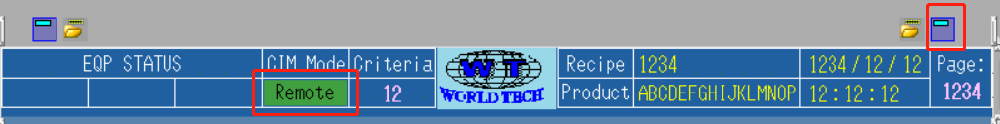
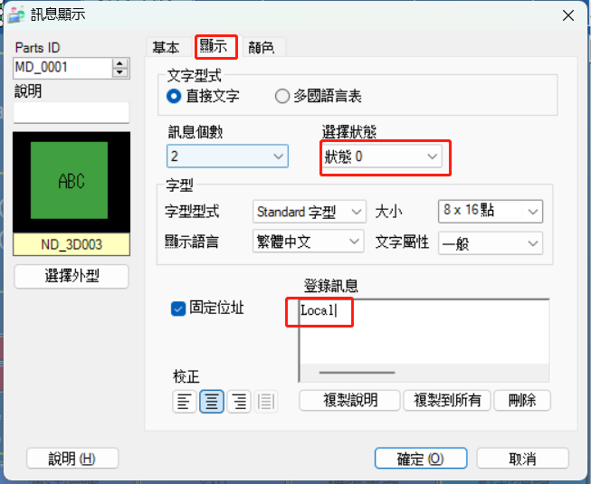
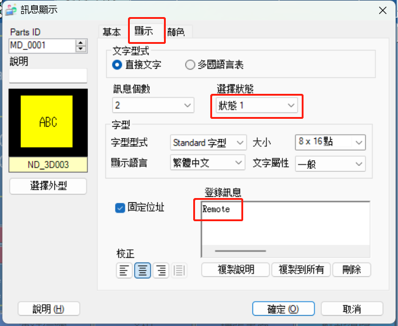
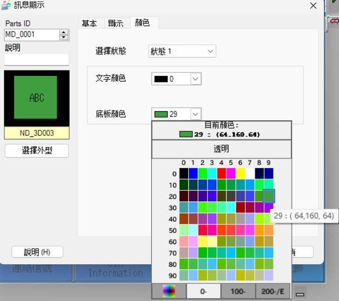
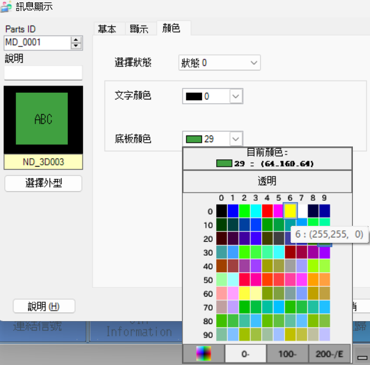
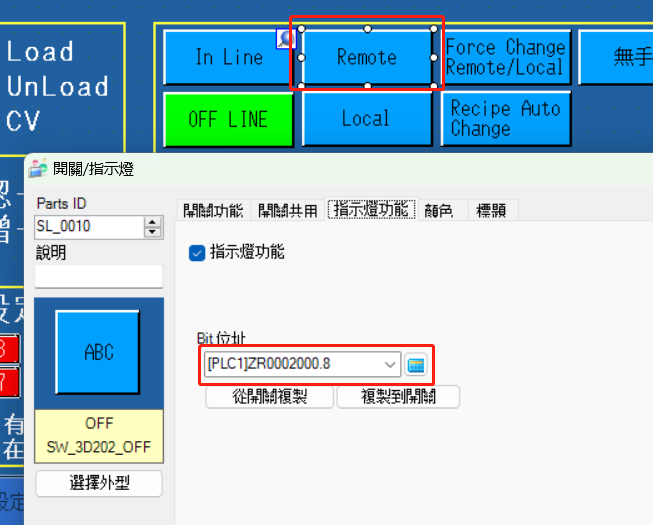
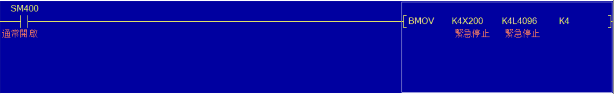
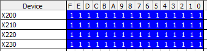
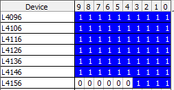

## 标准功能
| 序号  | 设备采集及控制功能                   |     | 设备信息 | 说明                                    |
| --- | --------------------------- | --- | ---- | ------------------------------------- |
| 1   | [设备模式监控功能](#设备模式监控功能)       | 下发  | 所有设备 | 设备支持离线、在线模式；离线指IoT系统不能控制设备，但是都可以抓取数据。 |
| 2   | [设备联网状态监控功能](#设备联网状态监控功能)   | 数采  | 所有设备 | 设备及IoT都需要各自监控联网状态。                    |
| 3   | [IoT联网状态监控功能](#IoT联网状态监控功能) | 数采  | 所有设备 | 设备及IoT都需要各自监控联网状态。                    |
| 4   | [设备状态监控功能](#设备状态监控功能)       | 数采  | 所有设备 | 设备状态一般包括运行、待机、故障、停止、保养等状态。            |
| 5   | [设备警报报告功能](#设备警报报告功能)       | 数采  | 所有设备 | 设备报警的信息采集。                            |
| 6   | [远程信息下发功能](#远程信息下发功能)                    | 下发  | 所有设备 | IoT系统下发信息给设备。                         |
| 7   | [远程时间同步功能](#远程时间同步功能)                    | 下发  | 所有设备 | IoT同步设备的日期和时间。                        |
| 8   | [设备生产数据上报](#设备生产数据上报)                    | 数采  | 所有设备 | 设备生产过程中的实时生产数据。                       |

### [设备模式监控功能](#标准功能)

*在人员按了Local按钮的一瞬间，且当前设备模式为Remote模式，就将模式切换为Local模式；反之，在人员按了Remote按钮的一瞬间，且当前设备模式为Local模式，就将模式切换为Remote模式。*

> Local：**`L264（开关功能）` = `ZR112为 0（当前设备模式显示）` = `L270（指示灯功能）`**
> Remote：**`L262（开关功能）` = `ZR112为 1（当前设备模式显示）` = `L271（指示灯功能）`**

`L262`、`L264`为人机上交互的按钮。

- `L262`为Remote按钮，用于切换设备模式为**在线模式**；
- `L264`为Local按钮，用于切换设备模式为**离线模式**。
  `ZR112`为人机上显示当前设备模式的点位。按照`设备交互文档`中所说，**`1表示在线，0表示离线`**。所以我们需要将人机上这一点位作出以下修改：
1. STEP 1: 点击右上角编辑页首，双击CIM Mode下`Remote`显示其属性。
   
- 点击`显示`,`状态0`时的`登录讯息`修改为`Local`；`状态1`时的`登录讯息`修改为`Remote`。
  
  
2. STEP 2: 点击`颜色`，修改`状态1`的`底板颜色`为`29`；修改`状态0`的`底板颜色`为`6`。
   
   
3. STEP 3: 最后点击`确定`完成此次修改。

---

`L262`、`L264`为**开关功能**的点位，随着人员的点按而ON/OFF，而切换到Remote模式时，**指示灯功能**的点位会常ON，表示当前模式为Remote模式。Local模式也一样。所以需要将Local模式和Remote模式的**指示灯功能**分别修改为`L270`和`L271`。

### [设备联网状态监控功能](#标准功能)

*IoT监控设备上`ZR3005`的值是否持续一秒加1，若未能监测到，则表示设备断网。`ZR3005`的值达到65535后会被置0，然后重新开始一秒加1。`*

### [IOT联网状态监控功能](#标准功能)

*IOT联网时，每秒加1写入`ZR3010`,Remote模式下实时将`ZR3010`的值与之前写入的值进行比较，若9秒内仍未发生变化，设备判断IOT断网，发出警报并蜂鸣。警报点位一般为`L2021`。*

> 之前写入的值为`D0`的值。

IOT断网警报不会影响机台继续生产，且可以通过按下机台上的重置按钮来消除警报及蜂鸣。`L4097`就是I/O点位置换后的重置点位，对应了机台上的重置按钮。

> **I/O点位置换**
> 
> 将`X200`到`X23F`置换为`L4096`到`L4159`  
> 
> 

> **`K4X200`**
> 这是三菱的组合位元件，三菱系列的PLC可以这种位元件组的形势接收或发送二进制数据，一个位元件组（`K1X200`）由4个连续的bit组成。
> 
> `KnMm`格式的数据意思是从`Mm`开始的`n*4`位所组成的数据，n可以为1，2，3，4，形式可以是`KnMm`，`KnXm`，`KnYm`。
> ---
> 
> 举个🌰
> `K2X0`——从`X0`开始的`2*4`位所组成的数据，也就是`X7`、`X6`、`X5`、`X4`、`X3`、`X2`、`X1`、`X0`这8位所组成的数据。
> `K1M10`——从`M10`开始的`1*4`位所组成的数据，也就是`M3`、`M2`、`M1`、`M0`这4位所组成的数据。

### [设备状态监控功能](#标准功能)

*设备状态共五种，详情见下表：*

| 运行          | 故障          | 闲置          | 停机          | 保养          |
|:-----------:|:-----------:|:-----------:|:-----------:|:-----------:|
| 原点复归并启动     | 出现异常并停机     | 启动后流片间隔     | 无原点复归，无启动   | 原点复归，无启动    |
| `ZR120 = 0` | `ZR120 = 1` | `ZR120 = 2` | `ZR120 = 3` | `ZR120 = 4` |

> `ZR120`为人机上点位
> 

### [设备警报报告功能](#标准功能)

*与上面提到的**I/O点位置换**同理，将`L2000`到`L2639`的警报实时传送到`ZR3700`到`ZR3739`，共计40 word（即640 bit）。*

### [远程信息下发功能](#标准功能)

*通过索引触发远程下发信息在人机上的显示、蜂鸣器及三色灯，内容可支持显示128个ASCII字符。同时，若IOT下发的消息类型是**间隔消息**，需要提供**间隔秒数**；若IOT下发的消息类型是**持续消息**，则蜂鸣器会长鸣。两个消息类型都可由人员手动解除。*

- `ZR60005`为人机上点位，用于显示信息的内容
- `ZR2029.1`为人机上点位【Confirm】，用于手动确认信息已收到，可解除信息的显示、蜂鸣器及三色灯。
---
`ZR3837`为IOT下发的索引，若当前索引与上一次索引（即`ZR3838`）不同，则会触发信息框的显示。

`D2516`、`D2517`、`D2518`、`D2519`为人机上设置的点位。目的是为了弹出上图中的信息框。
查看该设置的路径：**`专案➡️系统设定➡️系统设定➡️系统区`**

- CIM Message信息框的画面编号为5，所以视窗画面`D2517`的值为5。
- 视窗显示位置的`D2518`、`D2519`为CIM Message信息框显示的X、Y坐标。

在人员手动按下【Confirm】按钮后（即`ZR2029.1`这一软元件位ON了之后），将上面的视窗控制、视窗画面和视窗显示位置均清零，同时清空信息内容与消息类型，便可达到人员手动可解除信息显示、蜂鸣器及三色灯的效果。
> 由于三色灯及蜂鸣器是根据消息类型触发，所以一旦消息类型被清空，三色灯及蜂鸣器也会随之解除。
> 增加IOT对消息的间隔秒数（即`ZR3836`）设置
> 
> 之后将`B1501 T95`、`B1502`并联到蜂鸣器及三色灯的输入条件中即可。

### [远程时间同步功能](#标准功能)

*通过比对当前索引值与上一次索引值，比对结果为不一致时触发时间同步功能。从`ZR4290`到`ZR4296`共7个点位，**依次为：年、月、日、时、分、秒、星期**，增加范围控制（如**分**、**秒**只可为0至59，**时**只可为0到23等）。*

> **需要同步为`ZR4290`到`ZR4296`指定的时间日期，并显示到`SD210`到`SD216`**

> 对于**星期（即`ZR4296`）**，0：星期日，1到6：星期一到星期六

`DATEWR`是时间的写入，并**不会**随着实际时间而一秒一秒的改变显示的时间。

它写入到`DATERD`后的点位（如`SD210`），而`DATERD`后的点位才会与实际时间一样改变。

### [设备生产数据上报](#标准功能)

*此功能只需要提供点位供IOT采集数据，无需PLC程序的编写，故不作解释。*
## 放板机
|序号|设备采集及控制功能|设备信息|说明|
| --- | --- | --- | --- |
|9|[设备启停控制](#设备启停控制)|所有设备|上板机能接收IoT下发的停机/开机指令。|
|10|[是否存在载具信号](#是否存在载具信号)|所有设备|上板机中没有载具的时候，需产生空料信号。|
|11|采集Cassette ID|所有设备|上板机扫描cassette ID时，需将cassette ID信息上传，如果扫描不成功需要报警。|
|12|切换生产信息|所有设备|上板机在收到IoT下发的新cassette信息时，设备然后cassette投入数量清零，并重新计数|
|13|生产信息切换完成指令|所有设备|当设备切换生产信息完成时上报给IOT。|
|14|设备投入Panel信号|所有设备|设备投入Panel信号|
|15|设备产出Panel信号|所有设备|设备产出Panel信号|
|16|删除待生产虚拟Panel信息指令|所有设备|删除待生产虚拟Panel信息指令|
|17|控制取放板|所有设备|上板机能接收IoT下发的投板信号。（0：不投板，1：投板）|
|18|镭雕请求条码|所有设备|上板机检测到板子到达镭雕位置时，触发向上“请求条码”。（镭雕打码）|

### [设备启停控制](#上板机)

*由IOT触发设备的启动与停止。需要注意的是：**厂内威家骅设备在启动前都需要进行原点复归**。*

> 原点复归
> 

- IOT请求启动设备➡️人员确认设备原点复归完成➡️`B451`被设置为ON➡️`L256`被设置为ON➡️启动后将`L256`设置为OFF
- IOT请求停止设备➡️`B450`被设置为ON➡️`L257`被设置为ON➡️停止后将`L257`设置为OFF
> `L256`为人机上启动按钮；
> `L257`为人机上停止按钮。

设备完成启动或停止的动作，经过2s延迟之后将回复代码（`ZR30020.0`）设置为1；
若没有完成启动或停止的动作，则经过2s延迟之后将回复代码（`ZR30020.0`）设置为0。
回复代码（`ZR30020.0`）之后，将交握回复设置为ON，同时将`B450`和`B451`恢复到OFF状态。
### [是否存在载具信号](#上板机)

*机台工作位上一般都会有检测是否存在载具的感应器。*
*感应器ON则表示存在载具；感应器OFF则表示不存在载具。*

有些程序中会将感应器输出到`ZR2025.5`这个点位（可能是为了规范性吧），如果有`ZR2025.5`这一点位，直接用这个点位就好。如果没有，也可以选择直接用感应器。

---
- 感应器判断无载具时，会将`ZR39900`置`0`，同时将`D7230`(不存在载具)置`1`，0.2s延迟之后将索引值`ZR41405`改变。
- 感应器判断有载具时，会将`ZR39900`置`1`，同时将`D7231`(存在载具)置`1`，0.2s延迟之后将索引值`R41405`改变。
> IOT采集是**否存在载具的信号**的时机点是**索引值发生了变更**。

### 采集Cassette ID

*情况一：如果读取Cassette ID 3次后仍然失败，则发出报警`L2450`。*
*情况二：如果读取Cassette ID成功，则设定好的`D8105`到`D8109`范围内会存储Cassette ID。读取完成后`M1500`会ON,读取到的ID也会传送到`ZR3930`开始的10个word。0.1s延迟后将索引值变更，IOT监控到索引值变更，就会采集Cassette ID。*

PLC与Reader的通讯设置完毕后，还需要在PLC程序中添加**触发**和**采集Reader的读取结果**的程序，这一部分在`IOT_MES各功能.gxw`文件中的`M98`部分有完整的程序，可直接复制添加到程序中。
> - **Local状态下，机台升到工作位，按下Reload按钮**可触发并采集Reader的读取结果，读取完成后`M4360 ON`；
> - **Remote模式下，机台升到工作位**即可触发并读取Reader的读取结果，读取完成后`M4360 ON`。
> - **工作位上无载具**或**按下Reload按钮的一瞬间**，会将`M4360 OFF`。

以下几种情况会将将读取完成信号`M1500`及IOT采集读取结果的`ZR3930`开始的10个word的点位清空复位：
1. 对于放板机来说，完板时
2. 对于收板机来说，满板时
3. 无载具在工作位时
4. 按下人机上Reload按钮时
