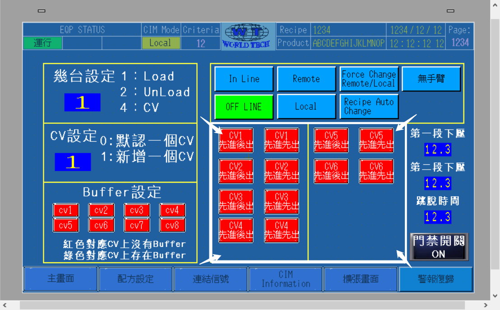

`设备交互文档-汇总-PLC.xlt`➡️`测机结果记录`所列功能为IOT与厂内所有设备对接所需要的各项功能。  
> 其中`标准功能`是每一个机台都需要完成的。  

`交互定义`分为三类：  
1. 放板机（也叫上板机）  
2. 收板机  
3. 中间段（除收放板之外的都叫中间段）  
   > `序号`相同，则功能相同。此`序号`同时也对应了同文件夹内`IOT_MES各功能.gxw`的`#01`至`#21`程式。 
   
   ## 共有的功能
   ### 投入、产出、切换生产指令
- `放#14`、`放#15`、`放#17`为`交互定义`中**放板机**（也叫上板机）所专属的功能；  
- `收#14`、`收#15`、`收#17`为`交互定义`中**收板机**所专属的功能。  
- `中#12#13`、`中#14`、`中#15`为`交互定义`中**中间段**所专属的功能。

  ### 读码器（仅收放板机）
- `低M90`、`高M90`、`M98`为设备与读码器通讯所需要的功能。  
  > **注意⚠️：**  
  > 「低」：低阶Reader，实际对应于DM60读码器；  
  > 「高」：高阶Reader，实际对应于DM374读码器。  
  > 具体使用哪一个，只需按照实际机台所配备的Reader型号进行添加即可。  
  > `M98`为触发 CST Reader 所用；  
  > `高M90`与`低M90`为触发 Panel Reader 所用。  

***所以，一般来说，收放板机都会有`M98`，收板机都会有`M90`。而中间段设备则两者都不需要。***
## 附属的功能
### 允许取放板
`M350`属于`放#17`与`收#17`的一部分。因其需要添加在 *额外的地方* 而单独列了出来。  

> **额外的地方**：除了程式中所列出来的部分之外，还需要在**手臂下降吸板之前**的程式中添加`M350`的A接点，例如`M350例`中所示。  
### 检查板子的输送情况及其带帐情况
这里的带帐，**帐**即板子的资料，所属的CST ID，所属的Panel ID，生产此板时所使用的配方参数等。  
`IOT_MES各功能.gxw`文件中的`附`为检查板子的输送情况。  

---
举个🌰：  

- 对于手臂与各个输送`M7000`至`M7009`以及暂存`M7020`至`M7023`，都是**板子经过时就会ON**。  
  - `M7000`至`M7009`的触发条件为手臂与各个输送的**入 在 出**感应器。所以 *一段输送* 或 *一个手臂* 便可以用一组**入 在 出**的感应器区分开来。  
  - 板子进入暂存后，程式便会以**10个word为一单位**，将板子的资料存入对应的`ZR45000`至`ZR48990`开始的位置。
---
### 先进先出
`IOT_MES各功能.gxw`文件中`FIFO`为先进先出暂存机的带帐资料。其中`ZR870.1`为人机界面第410页中白色方框内某一按钮的点位，此点位依据实际机台可能有所不同。
### 先进后出
`IOT_MES各功能.gxw`文件中`FILO`为先进后出暂存机的带帐资料。其中`ZR870.0`同样为上图中人机界面第410页中白色方框内某一按钮的点位，此点位依据实际机台可能有所不同。  
### 先进先出 与 先进后出 的拔片
这两者的拔片与收放板机的不同。
> 先进先出的拔片需要在拔出一片后将后续板子的资料向前补足。  
> 先进后出则不用。按照实际情况来即可。

- `IOT_MES各功能.gxw`文件中`FIFO#16`为**先进先出的拔片功能**。  
- `IOT_MES各功能.gxw`文件中`FILO#16`为**先进后出的拔片功能**。  
## 厂内威家骅PLC相关的简单介绍
厂内现使用的PLC CPU大多为三菱Q系列，少许为三菱FX系列。我们所需要修改的均为Q系列。故在此不做FX系列的介绍。  
对于三菱Q系列的PLC CPU，以下是一些常用指令介绍：  

- 常开`SM400`  
- 常闭`SM401`  
- 一秒时钟`SM412`  
  > 一秒 ON 一次，此为一秒时钟
- 步进位`DECO`  
  > 一般用于逐步完成机台的动作。如吸板子的手臂，从 *初始状态* 到 *下降* 到 *确认吸取到板子* 到 *上升* 等等都是由步进位完成的机台动作。`IOT_MES各功能.gxw`中`M350例`就是上述步进位中的两步。

对于威家骅的机台设备，点位从`L4096`开始存储的是设备的感应器，如入料感应器等。`L2000`开始存储的是设备的警报信息，如`L2435：有料无帐`。  

**总的修改思路是以`IOT_MES各功能.gxw`中各个点位的注释为主，去修改程式中不符合注释含义的点位。**